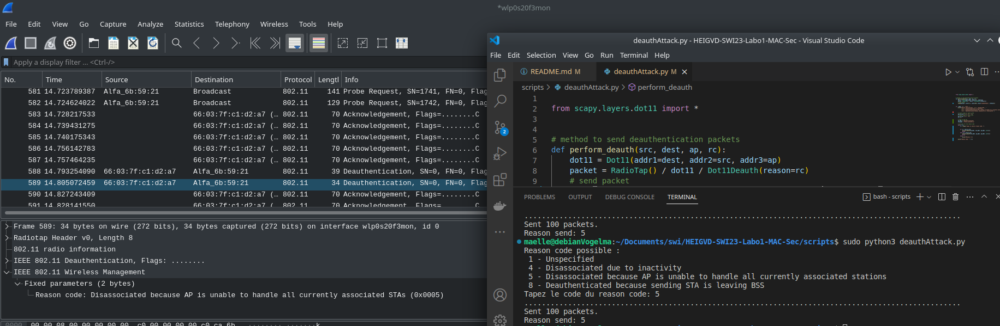

# Sécurité des réseaux sans fil

## Laboratoire 802.11 sécurité MAC

__A faire en équipes de deux personnes__


- [Sécurité des réseaux sans fil](#sécurité-des-réseaux-sans-fil)
	- [Laboratoire 802.11 sécurité MAC](#laboratoire-80211-sécurité-mac)
		- [Pour cette partie pratique, vous devez être capable de :](#pour-cette-partie-pratique-vous-devez-être-capable-de-)
	- [Quelques pistes utiles avant de commencer :](#quelques-pistes-utiles-avant-de-commencer-)
	- [Partie 1 - beacons, authenfication](#partie-1---beacons-authenfication)
		- [1. Deauthentication attack](#1-deauthentication-attack)
	- [Script](#script)
		- [2. Fake channel evil tween attack](#2-fake-channel-evil-tween-attack)
		- [3. SSID flood attack](#3-ssid-flood-attack)
	- [Partie 2 - probes](#partie-2---probes)
	- [Introduction](#introduction)
		- [4. Probe Request Evil Twin Attack](#4-probe-request-evil-twin-attack)
		- [5. Détection de clients et réseaux](#5-détection-de-clients-et-réseaux)
		- [6. Hidden SSID reveal (exercices challenge optionnel - donne droit à un bonus)](#6-hidden-ssid-reveal-exercices-challenge-optionnel---donne-droit-à-un-bonus)
	- [Livrables](#livrables)
	- [Échéance](#échéance)


### Pour cette partie pratique, vous devez être capable de :

*	Détecter si un certain client WiFi se trouve à proximité
*	Obtenir une liste des SSIDs annoncés par les clients WiFi présents

Vous allez devoir faire des recherches sur internet pour apprendre à utiliser Scapy et la suite aircrack pour vos manipulations. __Il est fortement conseillé d'employer une distribution Kali__ (on ne pourra pas assurer le support avec d'autres distributions). __Si vous utilisez une VM, il vous faudra une interface WiFi usb, disponible sur demande__.

Des routers sans-fils sont aussi disponibles sur demande si vous en avez besoin (peut être utile pour l'exercices challenge 6).

__ATTENTION :__ Pour vos manipulations, il pourrait être important de bien fixer le canal lors de vos captures et/ou vos injections (à vous de déterminer si ceci est nécessaire pour les manipulations suivantes ou pas). Une méthode pour fixer le canal a déjà été proposée dans un laboratoire précédent.

## Quelques pistes utiles avant de commencer :

- Si vous devez capturer et injecter du trafic, il faudra configurer votre interface 802.11 en mode monitor.
- Python a un mode interactif très utile pour le développement. Il suffit de l'invoquer avec la commande ```python```. Ensuite, vous pouvez importer Scapy ou tout autre module nécessaire. En fait, vous pouvez même exécuter tout le script fourni en mode interactif !
- Scapy fonctionne aussi en mode interactif en invoquant la commande ```scapy```.  
- Dans le mode interactif, « nom de variable + <enter> » vous retourne le contenu de la variable.
- Pour visualiser en détail une trame avec Scapy en mode interactif, on utilise la fonction ```show()```. Par exemple, si vous chargez votre trame dans une variable nommée ```beacon```, vous pouvez visualiser tous ces champs et ses valeurs avec la commande ```beacon.show()```. Utilisez cette commande pour connaître les champs disponibles et les formats de chaque champ.
- Vous pouvez normalement désactiver la randomisation d'adresses MAC de vos dispositifs. Cela peut être utile pour tester le bon fonctionnement de certains de vos scripts. [Ce lien](https://www.howtogeek.com/722653/how-to-disable-random-wi-fi-mac-address-on-android/) vous propose une manière de le faire pour iOS et Android. 

## Partie 1 - beacons, authenfication

### 1. Deauthentication attack

Une STA ou un AP peuvent envoyer une trame de déauthentification pour mettre fin à une connexion.

Les trames de déauthentification sont des trames de management, donc de type 0, avec un sous-type 12 (0x0c). Voici le format de la trame de déauthentification :


Le corps de la trame (Frame body) contient, entre autres, un champ de deux octets appelé "Reason Code". Le but de ce champ est d'informer la raison de la déauthentification. Voici toutes les valeurs possibles pour le Reason Code :

| Code | Explication 802.11                                                                                                                                     |
|------|-------------------------------------------------------------------------------------------------------------------------------------------------------|
| 0    | Reserved                                                                                                                                              |
| 1    | Unspecified reason                                                                                                                                    |
| 2    | Previous authentication no longer valid                                                                                                               |
| 3    | station is leaving (or has left) IBSS or ESS                                                                                                          |
| 4    | Disassociated due to inactivity                                                                                                                       |
| 5    | Disassociated because AP is unable to handle all currently associated stations                                                                        |
| 6    | Class 2 frame received from nonauthenticated station                                                                                                  |
| 7    | Class 3 frame received from nonassociated station                                                                                                     |
| 8    | Disassociated because sending station is leaving (or has left) BSS                                                                                    |
| 9    | Station requesting (re)association is not authenticated with responding station                                                                       |
| 10   | Disassociated because the information in the Power Capability element is unacceptable                                                                 |
| 11   | Disassociated because the information in the Supported Channels element is unacceptable                                                               |
| 12   | Reserved                                                                                                                                              |
| 13   | Invalid information element, i.e., an information element defined in this standard for which the content does not meet the specifications in Clause 7 |
| 14   | Message integrity code (MIC) failure                                                                                                                                              |
| 15   | 4-Way Handshake timeout                                                                                                                                              |
| 16   | Group Key Handshake timeout                                                                                                                                              |
| 17   | Information element in 4-Way Handshake different from (Re)Association Request/Probe Response/Beacon frame                                                                                                                                              |
| 18   | Invalid group cipher                                                                                                                                              |
| 19   | Invalid pairwise cipher                                                                                                                                              |
| 20   | Invalid AKMP                                                                                                                                              |
| 21   | Unsupported RSN information element version                                                                                                                                              |
| 22   | Invalid RSN information element capabilities                                                                                                                                              |
| 23   | IEEE 802.1X authentication failed                                                                                                                                              |
| 24   | Cipher suite rejected because of the security policy                                                                                                                                              |
| 25-31 | Reserved                                                                                                                                              |
| 32 | Disassociated for unspecified, QoS-related reason                                                                                                                                              |
| 33 | Disassociated because QAP lacks sufficient bandwidth for this QSTA                                                                                                                                              |
| 34 | Disassociated because excessive number of frames need to be acknowledged, but are not acknowledged due to AP transmissions and/or poor channel conditions                                                                                                                                              |
| 35 | Disassociated because QSTA is transmitting outside the limits of its TXOPs                                                                                                                                              |
| 36 | Requested from peer QSTA as the QSTA is leaving the QBSS (or resetting)                                                                                                                                              |
| 37 | Requested from peer QSTA as it does not want to use the mechanism                                                                                                                                              |
| 38 | Requested from peer QSTA as the QSTA received frames using the mechanism for which a setup is required                                                                                                                                              |
| 39 | Requested from peer QSTA due to timeout                                                                                                                                              |
| 40 | Peer QSTA does not support the requested cipher suite                                                                                                                                              |
| 46-65535 | Reserved                                                                                                                                              |
 
a) Utiliser la fonction de déauthentification de la suite aircrack, capturer les échanges et identifier le Reason code et son interpretation.

__Question : quel code est utilisé par aircrack pour déauthentifier un client 802.11. Quelle est son interpretation ?__

commande utilisé:

	aireplay-ng -0 0 -a 66:03:7F:C1:D2:A7 wlan0
	
Le code 7 est utilisé. Il indique "Class 3 frame received from nonassociated station". Ce qui veut dire que le client essaye d'envoyer des données avant qu'il ne soit associé.

__Question: A l'aide d'un filtre d'affichage, essayer de trouver d'autres trames de déauthentification dans votre capture. Avez-vous en trouvé d'autres ? Si oui, quel code contient-elle et quelle est son interpretation ?__

Filtre utilisé dans Wireshark: wlan.fixed.reason_code != 0x0007

Oui il y avait des trames avec le code 6 "Class 2 frame received from nonauthenticated station". Cela est lié à la commande aireplay-ng de la question précédente. Ce code signifie que l'AP est en train de se faire attaquer.

b) Développer un script en Python/Scapy capable de générer et envoyer des trames de déauthentification. Le script donne le choix entre des Reason codes différents (liste ci-après) et doit pouvoir déduire si le message doit être envoyé à la STA ou à l'AP :

* 1 - Unspecified
* 4 - Disassociated due to inactivity
* 5 - Disassociated because AP is unable to handle all currently associated stations
* 8 - Deauthenticated because sending STA is leaving BSS

## Script

Pour lancer le script: sudo python3 deauthAttack.py
Pour tester il faut changer le nom de l'interface, l'adresse MAC de l'AP et l'adresse MAC de la station.




__Question : quels codes/raisons justifient l'envoie de la trame à la STA cible et pourquoi ?__

Code 1 : La raison de l'envoi n'est pas spécifié.

Code 4 : La STA est inactive donc il faut la déconnecter

Code 5 : L'AP est surchargé et incapable de répondre aux tentatives de connexions actuelles

__Question : quels codes/raisons justifient l'envoie de la trame à l'AP et pourquoi ?__

Code 1: La raison de l'envoi n'est pas spécifié.

Code 8: La station quitte son BSS.

__Question : Comment essayer de déauthentifier toutes les STA ?__

En utilisant l'adresse MAC FF:FF:FF:FF:FF:FF de broadcast.

__Question : Quelle est la différence entre le code 3 et le code 8 de la liste ?__

Le Code 3 dit que le client est désauthentifié et quitte l'ESS. Avec le Code 8 le client va être désassocié du BSS par un AP.

__Question : Expliquer l'effet de cette attaque sur la cible__

L'attaque permet de déconnecter l'hôte cible (ou tous les clients) de l'AP auquel il était connecté. Il ne sera pas possible de pouvoir accéder à internet donc il sera obligé de se reconnecter.

### 2. Fake channel evil tween attack
a)	Développer un script en Python/Scapy avec les fonctionnalités suivantes :

* Dresser une liste des SSID disponibles à proximité
* Présenter à l'utilisateur la liste, avec les numéros de canaux et les puissances
* Permettre à l'utilisateur de choisir le réseau à attaquer
* Générer un beacon concurrent annonçant un réseau sur un canal différent se trouvant à 6 canaux de séparation du réseau original

__Question : Expliquer l'effet de cette attaque sur la cible__


### 3. SSID flood attack

Développer un script en Python/Scapy capable d'inonder la salle avec des SSID dont le nom correspond à une liste contenue dans un fichier text fournit par un utilisateur. Si l'utilisateur ne possède pas une liste, il peut spécifier le nombre d'AP à générer. Dans ce cas, les SSID seront générés de manière aléatoire.


## Partie 2 - probes

## Introduction

L’une des informations de plus intéressantes et utiles que l’on peut obtenir à partir d’un client sans fils de manière entièrement passive (et en clair) se trouve dans la trame ``Probe Request`` :


Dans ce type de trame, utilisée par les clients pour la recherche active de réseaux, on peut retrouver :

* L’adresse physique (MAC) du client (sauf pour dispositifs iOS 8 ou plus récents et des versions plus récentes d'Android). 
	* Utilisant l’adresse physique, on peut faire une hypothèse sur le constructeur du dispositif sans fils utilisé par la cible.
	* Elle peut aussi être utilisée pour identifier la présence de ce même dispositif à des différents endroits géographiques où l’on fait des captures, même si le client ne se connecte pas à un réseau sans fils.
* Des noms de réseaux (SSID) recherchés par le client.
	* Un Probe Request peut être utilisé pour « tracer » les pas d’un client. Si une trame Probe Request annonce le nom du réseau d’un hôtel en particulier, par exemple, ceci est une bonne indication que le client s’est déjà connecté au dit réseau. 
	* Un Probe Request peut être utilisé pour proposer un réseau « evil twin » à la cible.

Il peut être utile, pour des raisons entièrement légitimes et justifiables, de détecter si certains utilisateurs se trouvent dans les parages. Pensez, par exemple, au cas d'un incendie dans un bâtiment. On pourrait dresser une liste des dispositifs et la contraster avec les personnes qui ont déjà quitté le lieu.

A des fins plus discutables du point de vue éthique, la détection de client s'utilise également pour la recherche de marketing. Aux Etats Unis, par exemple, on "sniff" dans les couloirs de centres commerciaux pour détecter quelles vitrines attirent plus de visiteurs, et quelle marque de téléphone ils utilisent. Ce service, interconnecté en réseau, peut aussi déterminer si un client visite plusieurs centres commerciaux un même jour ou sur un certain intervalle de temps.

### 4. Probe Request Evil Twin Attack

Nous allons nous intéresser dans cet exercice à la création d'un evil twin pour viser une cible que l'on découvre dynamiquement utilisant des probes.
 
Développer un script en Python/Scapy capable de detecter une STA cherchant un SSID particulier - proposer un evil twin si le SSID est trouvé (i.e. McDonalds, Starbucks, etc.).

Pour la détection du SSID, vous devez utiliser Scapy. Pour proposer un evil twin, vous pouvez très probablement réutiliser du code des exercices précédents ou vous servir d'un outil existant.

__Question : comment ça se fait que ces trames puissent être lues par tout le monde ? Ne serait-il pas plus judicieux de les chiffrer ?__

Chiffrer les trames *Probe Request* n'aurait tout simplement pas de sens. En effet, ces trames sont faites pour vérifier l'existance d'un réseau avec un SSID donné dans les parages, or chiffrer le paquet ferait qu'un éventuel AP qui offre ce SSID ne pourrait potentiellement pas le comprendre.

Par exemple, imaginons un client qui s'est connecté par le passé au réseau "ABC" avec pour mot de passe "123". Si l'AP qui propose ce réseau Wifi change de mot de passe à "456", alors le paquet de *Probe Request* chiffré avec "123" fait qu'il ne pourra pas être déchiffré par l'AP.

__Question : pourquoi les dispositifs iOS et Android récents ne peuvent-ils plus être tracés avec cette méthode ?__

Tout simplement parce que l'adresse MAC utilisée par ces appareils n'est plus fixe. Lors de la connexion à un AP, ces appareils choisissent une adresse MAC aléatoire parmi un lot définit. La seule information que peut déduire un attaquant sniffant le réseau est qu'il y a des machines de types Android ou iPhone qui sont connectés au réseau sniffé, mais rien de plus.

### 5. Détection de clients et réseaux

a) Développer un script en Python/Scapy capable de lister toutes les STA qui cherchent activement un SSID donné

b) Développer un script en Python/Scapy capable de générer une liste d'AP visibles dans la salle et de STA détectés et déterminer quelle STA est associée à quel AP. Par exemple :

STAs &nbsp; &nbsp; &nbsp; &nbsp; &nbsp; &nbsp; &nbsp; &nbsp; &nbsp; &nbsp; &nbsp; &nbsp; &nbsp; &nbsp; &nbsp; &nbsp; &nbsp; &nbsp; &nbsp; APs

B8:17:C2:EB:8F:8F &nbsp; &nbsp; &nbsp; &nbsp; &nbsp; &nbsp; 08:EC:F5:28:1A:EF

9C:F3:87:34:3C:CB &nbsp; &nbsp; &nbsp; &nbsp; &nbsp; &nbsp; 00:6B:F1:50:48:3A

00:0E:35:C8:B8:66 &nbsp; &nbsp; &nbsp; &nbsp; &nbsp; &nbsp; 08:EC:F5:28:1A:EF


### 6. Hidden SSID reveal (exercices challenge optionnel - donne droit à un bonus)

Développer un script en Python/Scapy capable de reveler le SSID correspondant à un réseau configuré comme étant "invisible".

__Question__ : expliquer en quelques mots la solution que vous avez trouvée pour ce problème ?


## Livrables

Un fork du repo original . Puis, un Pull Request contenant :

- Script de Deauthentication de clients 802.11 __abondamment commenté/documenté__

- Script fake chanel __abondamment commenté/documenté__

- Script SSID flood __abondamment commenté/documenté__

- Script evil twin __abondamment commenté/documenté__

- Scripts détection STA et AP __abondamment commenté/documenté__

- Script SSID reveal __abondamment commenté/documenté__


- Captures d'écran du fonctionnement de chaque script

-	Réponses aux éventuelles questions posées dans la donnée. Vous répondez aux questions dans votre ```README.md``` ou dans un pdf séparé

-	Envoyer le hash du commit et votre username GitHub par email au professeur et à l'assistant


## Échéance

Le 15 mars 2023 à 23h59
