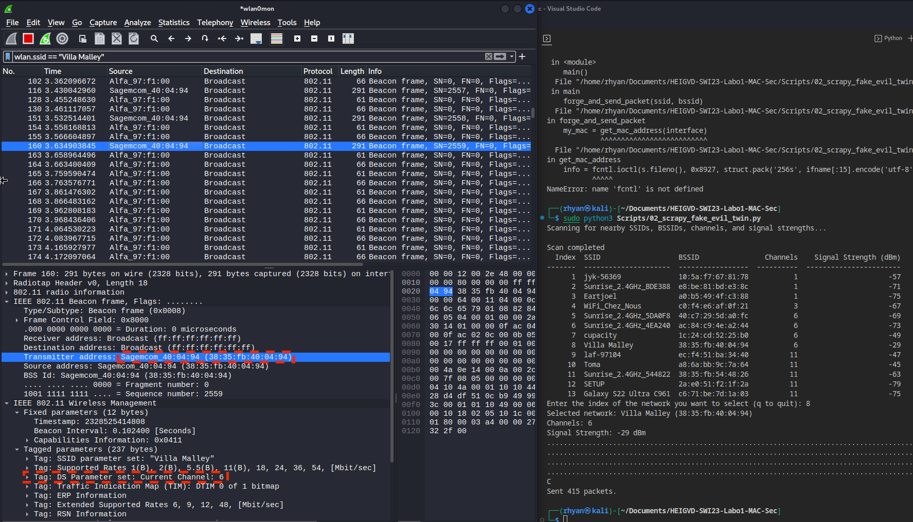
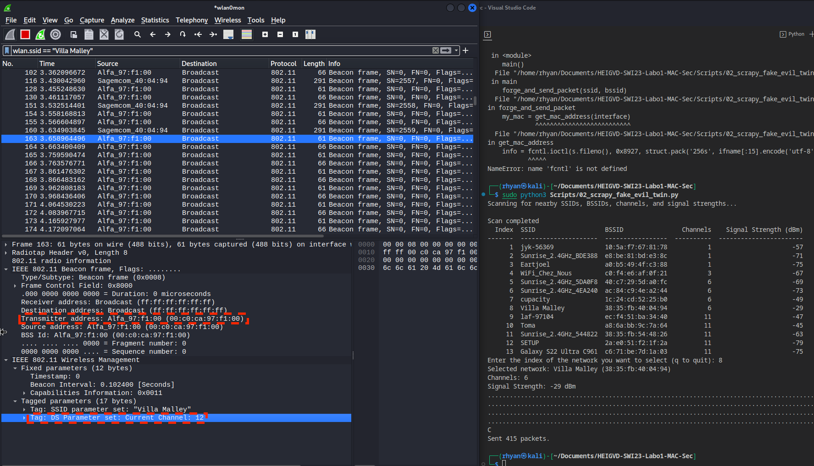

# SWI23-Labo1-MAC-Sec

## Partie 1 - beacons, authenfication

### 1. Deauthentication attack

aireplay-ng -0 1 -a 38:35:fb:40:04:94 -c a6:11:51:62:fd:5a wlan0mon

a) Utiliser la fonction de déauthentification de la suite aircrack, capturer les échanges et identifier le Reason code et son interpretation.

__Question__ : quel code est utilisé par aircrack pour déauthentifier un client 802.11. Quelle est son interpretation ?

Code 7 : Class 3 frame received from nonassociated station

__Question__ : A l'aide d'un filtre d'affichage, essayer de trouver d'autres trames de déauthentification dans votre capture. Avez-vous en trouvé d'autres ? Si oui, quel code contient-elle et quelle est son interpretation ?

Oui, il y en a plus de 100, mais ils ont tous le même Reason code.

b) Développer un script en Python/Scapy capable de générer et envoyer des trames de déauthentification. Le script donne le choix entre des Reason codes différents (liste ci-après) et doit pouvoir déduire si le message doit être envoyé à la STA ou à l'AP :

* 1 - Unspecified
* 4 - Disassociated due to inactivity
* 5 - Disassociated because AP is unable to handle all currently associated stations
* 8 - Deauthenticated because sending STA is leaving BSS

__Question__ : quels codes/raisons justifient l'envoie de la trame à la STA cible et pourquoi ?

Les codes de raison suivants justifient l'envoi de trames de déauthentification à la STA cible :

* Code 1 (Unspecified) : Ce code est utilisé pour indiquer une raison non spécifiée de déconnexion. Il peut être envoyé à la STA cible pour forcer la déconnexion sans donner de détails sur la raison exacte.
* Code 4 (Disassociated due to inactivity) : Ce code est utilisé pour indiquer que la STA a été déconnectée en raison de son inactivité. Il peut être envoyé à la STA pour simuler un processus de déconnexion initié par l'AP en raison de l'inactivité du client.

__Question__ : quels codes/raisons justifient l'envoie de la trame à l'AP et pourquoi ?

Le code de raison suivant justifie l'envoi de trames de déauthentification à l'AP :

Code 8 (Deauthenticated because sending STA is leaving BSS) : Ce code est utilisé pour indiquer que la STA quitte le Basic Service Set (BSS). Lorsqu'une STA envoie ce code à l'AP, elle informe l'AP qu'elle se déconnecte volontairement.

__Question__ : Comment essayer de déauthentifier toutes les STA ?

Pour déauthentifier toutes les STA, vous pouvez envoyer une trame de déauthentification avec l'adresse MAC de diffusion (broadcast) comme adresse de destination (adresse1). L'adresse MAC de diffusion est généralement ff:ff:ff:ff:ff:ff.

__Question__ : Quelle est la différence entre le code 3 et le code 8 de la liste ?

* Code 3 (Deauthenticated because sending STA is leaving (or has left) IBSS or ESS) : Ce code indique que la STA se déconnecte parce qu'elle quitte (ou a quitté) le Basic Service Set (BSS) ou le Extended Service Set (ESS). Il est utilisé pour signaler une déconnexion volontaire dans un environnement d'infrastructure ou ad-hoc.
* Code 8 (Deauthenticated because sending STA is leaving BSS) : Ce code est similaire au code 3, mais il est spécifique aux environnements d'infrastructure (c'est-à-dire lorsqu'une STA se déconnecte d'un AP). Il est utilisé pour indiquer que la STA se déconnecte volontairement du BSS.

__Question__ : Expliquer l'effet de cette attaque sur la cible

L'effet de cette attaque de déauthentification sur la cible dépend du code de raison utilisé. Dans tous les cas, la STA cible sera déconnectée de l'AP. La STA essaiera ensuite de se reconnecter, ce qui peut entraîner une dégradation des performances et une perte temporaire de connectivité. Dans certains cas, cela peut également permettre à un attaquant de capturer le processus d'authentification et d'association pour tenter de cracker le mot de passe du réseau Wi-Fi.

### 2. Fake channel evil tween attack

a) Développer un script en Python/Scapy avec les fonctionnalités suivantes :

* Dresser une liste des SSID disponibles à proximité
* Présenter à l'utilisateur la liste, avec les numéros de canaux et les puissances
* Permettre à l'utilisateur de choisir le réseau à attaquer
* Générer un beacon concurrent annonçant un réseau sur un canal différent se trouvant à 6 canaux de séparation du réseau original

__Question__ : Expliquer l'effet de cette attaque sur la cible

Lors de l'attaque Fake Channel Evil Twin, le script génère un beacon frame sur un canal différent avec le même SSID que l'AP (point d'accès) existante et le BSSID de l'attaquant. Pour un utilisateur ordinaire, il est difficile de différencier ces réseaux puisqu'ils partagent le même nom (SSID). Cela crée une confusion et augmente la probabilité que l'utilisateur se connecte accidentellement à l'Evil Twin plutôt qu'au réseau légitime.

Si, en plus de cela, l'attaquant utilise des techniques de dé-authentification pour déconnecter les clients du réseau légitime, les utilisateurs sont encore plus susceptibles de se connecter à l'Evil Twin. Une fois connectés au réseau malveillant, les clients sont exposés à diverses menaces, telles que l'interception et la manipulation des données, ainsi qu'à des attaques de type Man-in-the-Middle (MitM).

L'objectif principal de cette attaque est donc de tromper les utilisateurs en les amenant à se connecter au réseau malveillant et d'exploiter cette connexion pour mener des actions malveillantes ou obtenir un accès non autorisé aux données et aux communications des utilisateurs.

Nous pouvons voir l'attaque sur ces deux captures d'écran. La première montre un packet du vrai AP sur le canal 6 et le suivant celui de notre interface Alfa sur le canal 12.

Le vrai :

Le faux:
