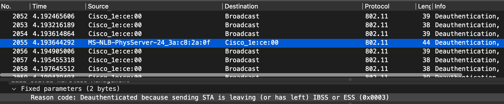
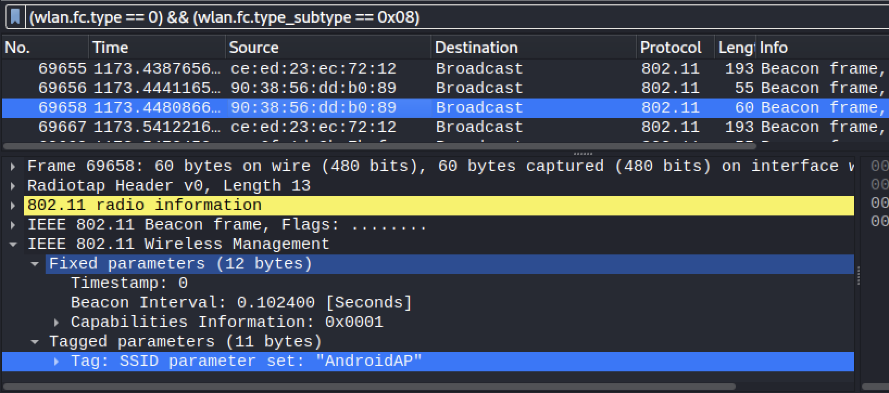
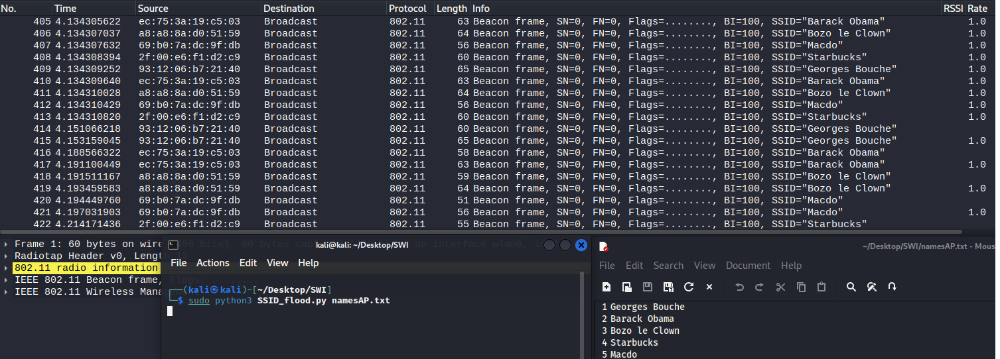
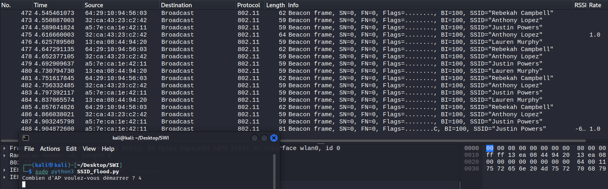

# Partie 1 - beacons, authenfication

## Deauthentication attack

### Question 1

***Quel code est utilisé par aircrack pour déauthentifier un client 802.11. Quelle est son interpretation ?***

De base, selon nos manipulations et analyses, le code utilisé et le `7 -  Class 3 frame received from nonassociated station`.

Cela peut être utilisé pour des raisons légitimes, par exemple pour forcer une station à se connecter à un AP plus proche dans le cas ou une STA recoit une trame de données ou de gestion d'une station qui n'est pas connectée à l'AP.

### Question 2

***a) A l'aide d'un filtre d'affichage, essayer de trouver d'autres trames de déauthentification dans votre capture. Avez-vous en trouvé d'autres ? Si oui, quel code contient-elle et quelle est son interpretation ?***

Nous avons utilisé le filtre `(wlan.fc.type == 0) && (wlan.fc.type_subtype == 0x0c)` pour trouver les trames de déauthentification.

Ce filtre Wireshark capture les trames Wi-Fi dont le type est de 0 (Management frames) et dont le sous-type est 0x0c (Beacon frame).

On a effectivement trouvé d'autres trames de déauthentification, par exemple la suivante :

qui contient le code `3 - Deauthenticated because sending STA is leaving IBSS or ESS`.

Ici c'est probalement une station qui quitte le réseau local sans fil (WLAN) auquel elle était connectée. et qui notifie l'AP de son départ du réseau.

***b) Développer un script en Python/Scapy capable de générer et envoyer des trames de déauthentification. Le script donne le choix entre des Reason codes différents (liste ci-après) et doit pouvoir déduire si le message doit être envoyé à la STA ou à l'AP :***

Le script est disponible [ici](./customScripts/deauth.py)

### Question 3

***Quels codes/raisons justifient l'envoie de la trame à la STA cible et pourquoi ?***

Le code 1 : Car il ne spécifie pas la raison.

Le code 4 : La STA est inactive depuis un certain temps et elle doit donc être déconnectée.

Le code 5 : Envoyée à la STA car l'AP est surchargé et il ne peut pas associer de stations supplémentaires.

### Question 4

***Quels codes/raisons justifient l'envoie de la trame à l'AP et pourquoi ?***

Le code 1 : Car il ne spécifie pas la raison.

Le code 8 : Il est envoyé à l'AP car la STA quitte le réseau (BSS). Il est utilisé dans le cas où le réseau est surchargé et que l'AP doit déconnecter des clients et les rediriger vers un autre AP (load-balancing).

### Question 5

***Comment essayer de déauthentifier toutes les STA ?***

En envoyant un packet `Broadcast` (FF:FF:FF:FF:FF:FF) à l'adresse de l'AP.

### Question 6

***Quelle est la différence entre le code 3 et le code 8 de la liste ?***

Comme dit précédemment le code 8 est plutôt utilisé lorsque le réseau est chargé de clients et donc l'AP va déconnecter certains clients et les redirigier vers un autre AP. Le code 3 ne propose pas de redirection vers un autre AP, il est plutôt utilisé lors d'une violation de sécurité.

### Question 7

***Expliquer l'effet de cette attaque sur la cible***

On va pouvoir forcer la déconnexion de clients qui se trouvent sur un AP, on va pouvoir le faire en forgeant une trame de deauthentification avec l'adresse MAC de la victime. De plus on pourra spécifier une raison à cette déconnection afin de la faire passer pour "normal".

## Fake channel evil tween attack

### Question 1 

***Expliquer l'effet de cette attaque sur la cible***

Cette attaque permet d'envoyer des beacons forgés afin de simuler un faux réseau. Ces trames forgées sont créées en récupérant les informations d'un des réseaux environnant. La victime pensera donc qu'il s'agit d'un vrai réseau sur lequel il peut se connecter. Ensuite l'attaquant surveiller le traffic et voler des informations des différentes victimes.

Dans notre cas le script permet de faire cette attaque sur un réseau ouvert (ce qui n'est pas très réaliste). De plus nous n'en faisons rien, dans le sens où nous ne faisons pas d'actions malveillentes sur les personnes qui se connecte sur notre faux AP.

Le script est disponible [ici](./customScripts/evilTween.py), il est "interactif" et donc ne prends pas de paramètres en particulier.

Nous avons fait quelques tests avec un partage de connexion Android (AndroidAP), voici une capture d'écrans des trames Beacon capturées par Wireshark lors de l'éxécution de notre attack :

## SSID flood attack
***Développer un script en Python/Scapy capable d'inonder la salle avec des SSID dont le nom correspond à une liste contenue dans un fichier text fournit par un utilisateur. Si l'utilisateur ne possède pas une liste, il peut spécifier le nombre d'AP à générer. Dans ce cas, les SSID seront générés de manière aléatoire.***

Le script est disponible [ici](./customScripts/SSID_flood.py). On peut soit passer un fichier txt contenant un nom par ligne, soit utiliser le script sans liste. A ce moment l'utilisateur doit entrer un nombre d'AP à créer, les noms et adresses MAC sont générés aléatoirement à l'aide de la librairie Faker de python (https://faker.readthedocs.io/en/master/#basic-usage)

Exemple de fonctionnement avec une liste fournie par l'utlisateur.

Exemple de fonctionnement sans liste de noms fournie par l'utilisateur.

# Partie 2 - probes

